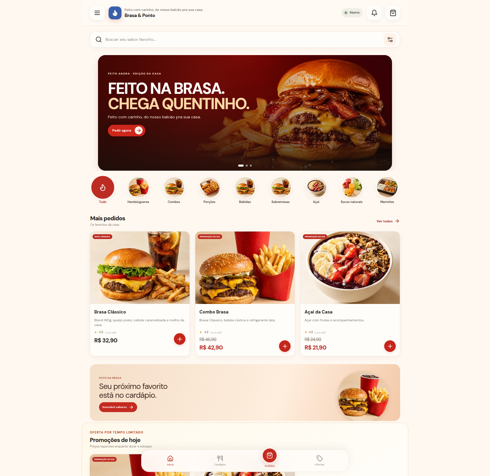
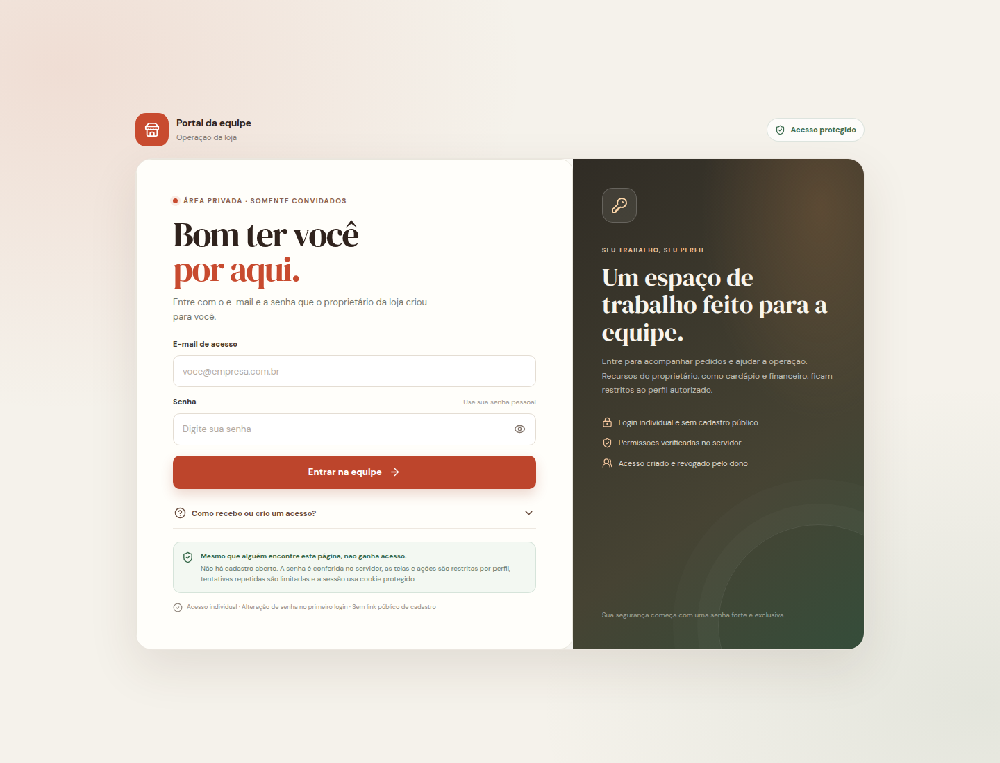

  

<h1 align="center">Delivery — Brasa & Ponto</h1>

  Uma experiência de delivery para pedir, acompanhar e preparar pedidos em um só lugar.
   
  Projeto demonstrativo white-label, pronto para ganhar a identidade de diferentes restaurantes.

  
  

  <strong><a href="https://delivery-app-demo-khaleesi.vercel.app/">Conheça a loja demonstrativa Brasa & Ponto</a></strong>

---

## Sobre o projeto

O **Delivery** transforma o cardápio de uma loja em uma jornada simples: o cliente escolhe o que deseja, envia o pedido e pode acompanhar o andamento. Do outro lado, a equipe organiza a operação, mantém o cliente informado e encaminha as entregas.

A **Brasa & Ponto** é a loja de demonstração deste projeto. O mesmo conceito pode ser personalizado para hamburguerias, lanchonetes, açaiterias, restaurantes e outros negócios de alimentação — com visual, cardápio e comunicação próprios para cada marca.

## A loja por dentro

  
   
  Cardápio online com hambúrgueres, combos, porções, bebidas, sobremesas, açaí, sucos naturais e marmitex.

## Uma jornada completa de pedidos

| Momento | O que acontece |
| --- | --- |
| **Escolher** | O cliente explora o cardápio, encontra promoções e monta a sacola. |
| **Pedir** | O checkout reúne os dados de contato e entrega para a equipe receber o pedido. |
| **Preparar** | A equipe acompanha os pedidos e atualiza cada etapa da operação. |
| **Entregar** | O proprietário organiza a equipe de entregadores; os atendentes atribuem pedidos prontos a um entregador. |
| **Acompanhar** | O cliente pode consultar o andamento do pedido e entrar em contato com a loja. |

## Recursos em destaque

- **Cardápio convidativo:** categorias, fotos, produtos em destaque e preços promocionais.
- **Pedidos em fluxo:** acompanhamento das etapas do pedido em uma área reservada à equipe.
- **Equipe com funções distintas:** o proprietário cuida da loja e da equipe; o atendente ajuda na operação sem alterar os itens do pedido.
- **Entregadores:** cadastro e organização pelo proprietário, com atribuição dos pedidos prontos pela equipe.
- **Contato fácil:** acesso ao WhatsApp e telefone do cliente a partir do pedido.
- **Comandas para cada necessidade:** observações internas identificadas por autor podem sair na comanda da cozinha; a via do cliente não revela notas internas.
- **Loja sob controle:** abertura, fechamento e pausa temporária administrados pelo proprietário.

## Portal da equipe

  
   
  Uma área de trabalho separada da loja pública, com acesso individual para a equipe.

A equipe entra por um portal privado, sem cadastro público. O proprietário cria os acessos e define quem pode administrar a loja; funcionários recebem apenas as ferramentas necessárias para atender e encaminhar pedidos.

## Tecnologias e ferramentas

  &nbsp;&nbsp;
  &nbsp;&nbsp;
  &nbsp;&nbsp;
  &nbsp;&nbsp;
  &nbsp;&nbsp;
  &nbsp;&nbsp;
  &nbsp;&nbsp;
  

  TypeScript · JavaScript · HTML · CSS
   
  React · Vite · Tailwind CSS · Node.js · Express · tRPC · MySQL · Drizzle ORM · Vercel

---

## Personalização white-label

Cada loja pode receber uma identidade visual e uma experiência próprias: nome, cores, tipografia, imagens, categorias, produtos, promoções, informações de contato e regras de entrega. O projeto é pensado para ser adaptado e publicado para cada negócio, mantendo os dados e a operação de cada loja separados.

> **Demonstração:** os produtos, preços e informações da Brasa & Ponto são fictícios e servem para apresentar a experiência do sistema.

## Autoria

Projeto desenvolvido por **Khaleesi Saithe**.

- GitHub: [@Khaleesisaithe](https://github.com/Khaleesisaithe)
- Projeto: [Delivery-demo](https://github.com/Khaleesisaithe/Delivery-demo)
- Demonstração: [delivery-app-demo-khaleesi.vercel.app](https://delivery-app-demo-khaleesi.vercel.app/)
